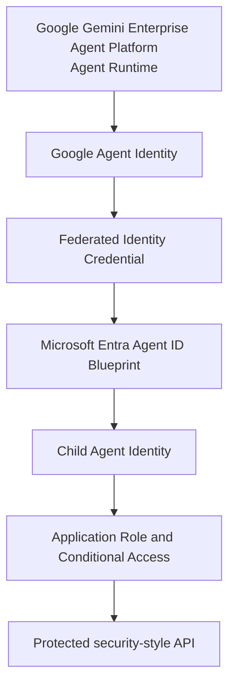

# Gemini Agent Runtime to Agent 365 and Entra Reference

[](https://github.com/anthfuller/gemini-agent-runtime-agent365-entra-reference/actions/workflows/repository-quality.yml)

This repository provides a validated reference implementation for federating a Google Gemini Enterprise Agent Platform Agent Runtime identity with Microsoft Entra Agent ID, applying distinct child Agent Identity authorization and Conditional Access decisions, and calling a protected security-style API.

> [!IMPORTANT]
> This is a validated reference pattern from one controlled environment. It is intended for reference, evaluation, and controlled nonproduction validation. It is not presented as production-ready guidance or as a universal support statement for every third-party agent, tenant, protected resource, SDK version, or Conditional Access design.

## Why this reference matters

The reference demonstrates how a cloud-hosted agent can use its workload identity instead of a stored client secret, become a governed child Agent Identity in Entra, receive least-privilege application authorization, and be evaluated by Conditional Access before reaching a protected API.

## Architecture flow



The implementation performs two Microsoft identity-platform exchanges:

- **T1:** The Entra Agent ID blueprint accepts the Google Agent Identity assertion under the configured federated trust and selects the child Agent Identity through `fmi_path`.
- **T2:** The selected child Agent Identity uses T1 as its client assertion to request an access token for the protected API. Conditional Access can block this exchange before the API is reached.

See [Architecture](docs/architecture.md) and [Identity and federation](docs/identity-and-federation.md).

## Agent 365 and Entra Agent ID are separate planes

**Agent 365 Connected Platform / Registry** provides agent inventory, discovery, registration, and management context. **Microsoft Entra Agent ID** provides the identity, federation, token issuance, application-role authorization, and Conditional Access controls exercised by this reference.

Registry discovery does not itself authenticate the runtime, issue the protected API token, or automatically correlate a discovered Google record with the separately created Entra blueprint and child identities. See [Agent 365 Registry boundary](docs/agent365-registry.md).

## Five validated outcomes

| Scenario | Validated result |
|---|---|
| No bearer token | Protected API returns HTTP 401 |
| Valid child identity without `Investigation.Read` | Authentication succeeds; protected API returns HTTP 403 |
| Approved identity with `Investigation.Read` | Protected API returns HTTP 200 and `LAB-001` |
| Conditional Access targets the deny identity | T1 succeeds; T2 is blocked; protected API is not reached |
| Approved identity remains outside the deny-policy scope | T1 and T2 succeed; protected API remains allowed |

These outcomes describe the validated reference environment only. Follow the [validation matrix](docs/validation-matrix.md) and retain only sanitized evidence.

## Quick start

1. Review [Prerequisites](docs/deployment-guide.md#prerequisites).
2. Understand [Identity and federation](docs/identity-and-federation.md).
3. Follow the [Deployment guide](docs/deployment-guide.md).
4. Configure [Conditional Access](docs/conditional-access.md) only after the 401, 403, and 200 controls pass.
5. Execute the [Validation matrix](docs/validation-matrix.md).
6. Use the [Client demo runbook](docs/demo-runbook.md).
7. Diagnose failures with [Troubleshooting](docs/troubleshooting.md).

## Prerequisites

- A nonproduction Google Cloud project that supports Gemini Enterprise Agent Platform Agent Runtime and Agent Identity.
- A Microsoft Entra tenant with access to the required Agent ID and Conditional Access capabilities.
- Permissions to create the protected API registration, application role, blueprint, child Agent Identities, federated identity credential, and narrowly scoped policy.
- An HTTPS host for the synthetic protected API.
- Python and Google Cloud tooling appropriate to the validated dependency set.
- Separate authorized administrators for production changes where organizational policy requires them.

Do not infer current SDK or Microsoft Graph request shapes from this repository. Verify changing administrative procedures against current Google and Microsoft documentation.

## Repository layout

| Path | Purpose |
|---|---|
| `src/` | Sanitized agent, invocation client, and protected API |
| `deployment/` | Agent deployment/update scripts, dependencies, and API process definition |
| `config/.env.example` | Placeholder-only configuration template |
| `docs/` | Reference architecture, deployment, governance, validation, and operational guidance |
| `validation/` | Scenario-specific expected results |
| `scripts/` | Credential-free repository validation |
| `infra/` | Boundary for future infrastructure as code |
| `.github/workflows/` | Offline repository-quality automation |

## Configuration

```bash
cp config/.env.example .env
```

Populate `.env` locally and never commit it. The implementation keeps tenant IDs, project IDs, application IDs, resource identifiers, runtime names, bucket names, and environment URLs in configuration.

## Current limitations

This repository does not claim validation for:

- Microsoft Sentinel integration;
- Microsoft Purview integration;
- Agent 365 observability or telemetry ingestion;
- arbitrary Microsoft Graph resource operations;
- automatic correlation of Agent 365 Registry records with Entra Agent ID objects;
- production resilience, scale, disaster recovery, or compliance posture; or
- every third-party agent platform, identity configuration, protected resource, or Conditional Access policy.

Microsoft [`Agent365-python`](https://github.com/microsoft/Agent365-python) remains an external dependency/reference only. Its source is not vendored, and it is not required for the validated federation flow.

## Roadmap

- Validate migration from `vertexai.Client` to `agentplatform.Client`.
- Add Terraform, Bicep, or verified Microsoft Graph automation.
- Add credential-aware CI/CD deployment through separately approved environments.
- Test Agent 365 SDK registration and observability capabilities as independent integrations.

The existing `vertexai.Client` usage is retained solely to preserve the validated baseline and is tracked technical debt.

## Security and responsible use

Start with synthetic data and nonproduction environments. Never include assertions, access tokens, authorization headers, private keys, client secrets, customer records, or environment identifiers in issues or evidence.

See [Security policy](SECURITY.md), [Contributing](CONTRIBUTING.md), and [Troubleshooting](docs/troubleshooting.md).

## License

Copyright 2026 Anthony Fuller.

Licensed under the [Apache License 2.0](LICENSE). Product and company names are used only for identification; see [NOTICE](NOTICE).
